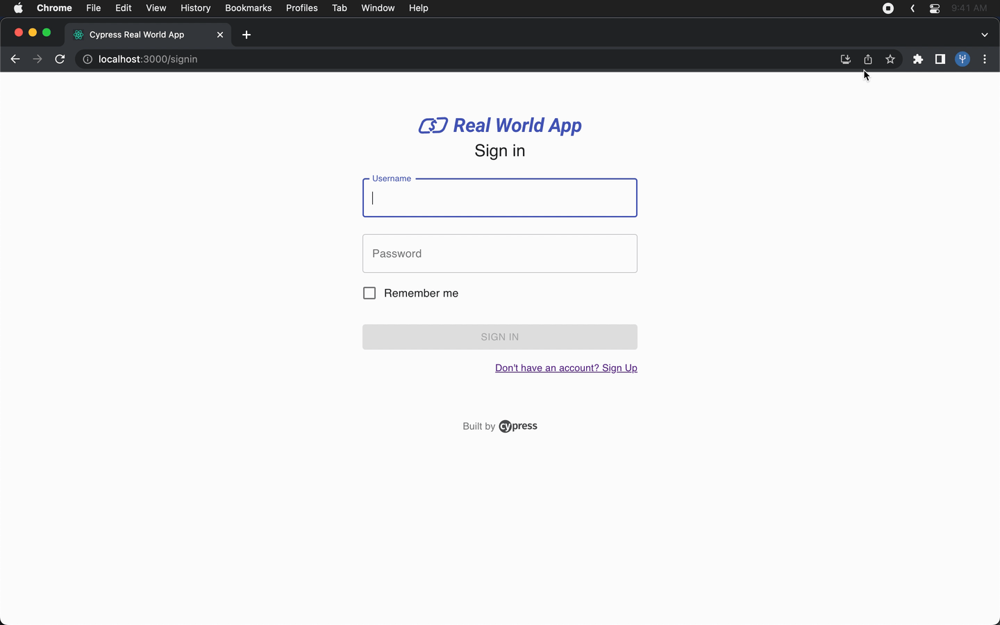

# Trydent

  


Trydent is a **lightweight** developer tool built from the ground up to **automate** the generation of Cypress test code, **simplifying** and **streamlining** the testing process for applications.

The primary purpose of Trydent is to help developers and quality assurance engineers easily generate Cypress test code, saving time and effort while ensuring comprehensive test coverage. With Trydent, you can create tests quickly, detect issues earlier in the development process, and maintain high-quality code standards.  

<div align="center" style="display: flex; justify-content: center; align-items: center; gap: 25px;">
  
  
  
  
</div>  

<br>  

<p align="center">
  
</p>


## Table of Contents
1. [Trydent](#trydent)
2. [Features](#features)
3. [Benefits](#benefits)
4. [Privacy Statement](#privacy-statement)
5. [Installation](#installation)
6. [Scripts](#scripts)
7. [File Structure](#file-structure)
8. [Contributions](#contributions)
9. [Our Team](#our-team)
10. [License](#license)


## Features
Trydent offers several key features that make it a valuable tool for test generation:

1. **Automated Cypress Test Code Generation**: Trydent automatically generates Cypress test code for your web application, saving you time and effort
2. **Intuitive Developer Tool Interface**: Trydent is a Developer Tool that can be utilized directly in your browser.
3. **Compatibility with Various Web Applications and Frameworks**: Trydent is compatible with a wide range of web applications and frameworks, including React, Angular, Vue, and more.

## Benefits
By using Trydent, developers can enjoy numerous benefits, such as:
1. **Increased Productivity**: Trydent automates the generation of Cypress test code, cutting down time spent on creating E2E test by *over 60%*.
2. **Improved Test Coverage**: Trydent helps developers ensure comprehensive test coverage for their application.
3. **Faster Development Cycles**: Trydent helps developers detect issues earlier in the development process, so teams can quickly address problems and move on to the next stage.  

## Privacy Statement
Trydent logs user inputs during development for the purpose of creating end-to-end tests. The application does not extract or store any personal data from users. However, as a precaution, developers should avoid using sensitive information when genereating test code. This ensure that no sensitive data is inadvertently recorded or stored in the generated tests.

## Installation
Please note that Trydent is not yet available on the Chrome Web Store.  
1. Ensure you have the required prerequisites installed:
    - [npm](https://www.npmjs.com/)
    - [Google Chrome](https://www.google.com/chrome/)
2. Fork the Trydent repository to your own GitHub account.
3. Clone your forked repository to your local machine.
```bash
git clone https://github.com/<your-github-username>/trydent.git
```
4. Navigate to the root project directory and install dependencies.
```bash
cd trydent
npm install
```
5. Navigate to the client directory and install dependencies.
```bash
cd client
npm install
```
6. Build the application in the client directory
```bash
npm run build
```
7. Load Trydent into your Chrome extensions.
    - Open Google Chrome and navigate to `chrome://extensions/`
    - Enable Developer Mode
    - Click "Load unpacked" and select the `extensions` directory in your local 'trydent' repository.  

Now you should be able to access Trydent in the developer tools or right-click and select Trydent.


## Scripts
Below are descriptions of each npm script:

- `npm start`: Starts the development server using Vite.
- `npm run build`: Runs `vite build` to build your application for production. This command generates the final, optimized assets that can be deployed to a web server. Also runs the TypeScript compiler (`tsc`) to type-check the TypeScript files and convert to js files in `extensions/bundle` folder
- `npm run build:watch`: Runs `vite build` on watch mode, monitoring for any changes and updating bundling on save.
- `npm run serve`: Starts a local server to preview the production build. This is for testing the built assets before deploying. This should not be used as a production server.
- `npm test`: Runs Jest tests

## File Structure
```
.
├── LICENSE
├── README.md
├── __tests__
│   └── client
│       ├── components
│       │   └── pages
│       │       └── testCreator.test.js
│       └── utils
│           └── inputLogger.test.js
├── babel.config.js
├── client
│   ├── components
│   │   ├── App.tsx
│   │   ├── TopBar.tsx
│   │   └── pages
│   │       ├── CodeBlock.tsx
│   │       ├── TestPage.tsx
│   │       └── WelcomePage.tsx
│   ├── cypress
│   │   ├── e2e
│   │   │   └── tydent.cy.ts
│   │   └── support
│   │       ├── commands.ts
│   │       └── e2e.ts
│   ├── cypress.config.ts
│   ├── index.html
│   ├── main.tsx
│   ├── package-lock.json
│   ├── package.json
│   ├── scss
│   │   ├── CodeBlock.module.scss
│   │   ├── EventLogger.module.scss
│   │   ├── TestPage.scss
│   │   ├── TopBar.module.scss
│   │   ├── WelcomePage.module.scss
│   │   ├── _styles.scss
│   │   ├── _variables.scss
│   │   ├── application.scss
│   │   └── components
│   │       ├── buttons.scss
│   │       └── input.scss
│   ├── tsconfig.json
│   ├── tsconfig.node.json
│   ├── utils
│   │   ├── inputLogger.ts
│   │   ├── testCreator.ts
│   │   └── types
│   │       └── types.ts
│   └── vite.config.ts
├── extension
│   ├── background.js
│   ├── bundles
│   │   ├── components
│   │   │   ├── App.js
│   │   │   ├── TopBar.js
│   │   │   └── pages
│   │   │       ├── CodeBlock.js
│   │   │       ├── TestPage.js
│   │   │       └── WelcomePage.js
│   │   ├── cypress.config.js
│   │   ├── index.html
│   │   ├── main.js
│   │   ├── utils
│   │   │   ├── testCreator.js
│   │   │   └── types
│   │   │       └── types.js
│   │   └── vite.config.js
│   ├── content-script.js
│   ├── devtool.html
│   ├── devtools.js
│   ├── manifest.json
│   ├── panel.html
│   └── panel.js
├── package-lock.json
└── package.json
```

## Contributions
We welcome contributions from the community. If you are interested in contributing to this project, please refer to our [Contributing Guidelines]() for more information.


## Our Team 

<table style="width:40%;">
  <tr>
    <td>
      
    </td>
    <td>
      <strong>Alastair Scheuermann</strong><br/>
      <a href="https://github.com/alastairsounds">GitHub</a><br/>
      <a href="https://www.linkedin.com/in/alastairsounds/">LinkedIn</a>
    </td>
  </tr>
  <tr>
    <td>
      
    </td>
    <td>
      <strong>Eric Dunn</strong><br/>
      <a href="https://github.com/ELDunn">GitHub</a><br/>
      <a href="https://www.linkedin.com/in/ericldunn/">LinkedIn</a>
    </td>
  </tr>
  <tr>
    <td>
      
    </td>
    <td>
      <strong>Jacob Gillan</strong><br/>
      <a href="https://github.com/JakeGillan/">GitHub</a><br/>
      <a href="https://www.linkedin.com/in/jacob-gillan/">LinkedIn</a>
    </td>
  </tr>
  <tr>
    <td>
      
    </td>
    <td>
      <strong>Nicholas Ly</strong><br/>
      <a href="https://github.com/nicholas-l-ly">GitHub</a><br/>
      <a href="https://www.linkedin.com/in/nicholasly/">LinkedIn</a>
    </td>
  </tr>
  <tr>
    <td>
      
    </td>
    <td>
      <strong>Samuel Lee</strong><br/>
      <a href="https://github.com/leesamuel423">GitHub</a><br/>
      <a href="https://www.linkedin.com/in/leesamuel423/">LinkedIn</a>
    </td>
  </tr>
</table>


## License
This project is licensed under the terms of the [MIT LICENSE](./LICENSE)
